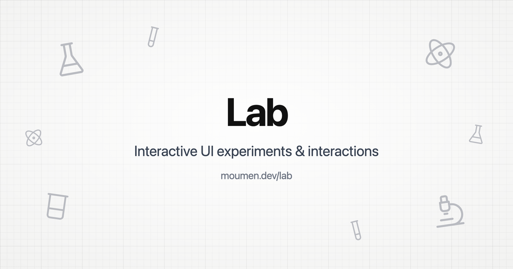

<p align="center">
  <a href="https://lab.moumen.dev">
    
  </a>
</p>

<h1 align="center">moumenlab</h1>

<p align="center">
  <strong>Less is more.</strong> A small lab of the components we build every day,
  rethought for better feel, React + Tailwind, on the shadcn registry.
</p>

<p align="center">
  <a href="https://lab.moumen.dev/components">Browse</a> ·
  <a href="https://github.com/moumen-soliman/lab/issues/new">Report a bug</a> ·
  <a href="https://github.com/moumen-soliman/lab/issues/new">Feature request</a>
</p>

<p align="center">
  <a href="LICENSE"></a>
  <a href="https://github.com/moumen-soliman/lab/issues"></a>
  <a href="https://www.npmjs.com/package/moumenlab"></a>
</p>



## Features

- **Everyday components, rethought** — Menus, OTP inputs, upload staging, command palettes, and more — each built to do one thing well
- **Watch, then install** — Short looping clips on [lab.moumen.dev](https://lab.moumen.dev/components); open any for the live demo, blueprint, and source
- **shadcn registry** — Install with `npx moumenlab add` or the shadcn CLI; you own the code, no runtime package
- **Fully Tailwind** — No CSS files to import; shared tokens (`lab-theme`) merge into your `@theme` on install
- **Motion-first** — Animations with [motion](https://motion.dev)/react; interruptible, layout-aware, reduced-motion aware

## Install a component

```bash
npx moumenlab add hover-expand-icon-strip
npx moumenlab add schedule-builder -c apps/web   # monorepo: target the app workspace
npx moumenlab list
```

Or use the shadcn CLI directly:

```bash
npx shadcn@latest add https://lab.moumen.dev/r/hover-expand-icon-strip.json
```

Either way the component and its shared theme tokens are copied into your project.

### Requirements

- React 19
- Tailwind CSS v4
- [motion](https://motion.dev) (installed automatically by the CLI)
- Node.js 18+

## Turbo Monorepo

- Managed with Turborepo and pnpm workspaces
- Run tasks via `turbo run <script>` (e.g. `pnpm --filter web dev` for the showcase)
- Node.js 20+ is required for the monorepo tooling

```
apps/web              Showcase site (Next.js App Router + React 19 + Tailwind v4)
  app/                Routes: / (landing), /components, /components/[slug]
  registry/lab/*      Installable component sources (one folder each)
  registry.json       Registry source of truth (metadata + files)
  src/showcases/*     Per-component live demos
packages/moumenlab    The `npx moumenlab` CLI
```

## Tech Stack

- [Turborepo](https://turbo.build/repo) + pnpm Workspaces
- [Next.js](https://nextjs.org) 15
- [React](https://react.dev) 19
- [TypeScript](https://www.typescriptlang.org)
- [Tailwind CSS](https://tailwindcss.com) v4
- [motion](https://motion.dev)
- [shadcn/ui](https://ui.shadcn.com) registry format
- [Geist](https://vercel.com/font) (site typography)

## Getting Started

Install dependencies:

```bash
pnpm install
```

Run the development server:

```bash
pnpm dev
```

Open [http://localhost:3001](http://localhost:3001) in your browser (web app port).

Useful scripts:

```bash
pnpm build          # build everything
pnpm check          # zero-custom-CSS + registry invariants
pnpm typecheck      # TypeScript across the monorepo
```

## Usage

Browse components at [lab.moumen.dev/components](https://lab.moumen.dev/components), open any for the live playground, then install into your app:

```bash
npx moumenlab add otp-segmented-input drag-to-reorder-list
```

Component pages are statically generated from `registry.json`. Registry payloads at `/r/*.json` are built on every deploy — the same file the site shows (highlighted) and the CLI installs.

## Add a component

```bash
cd apps/web
pnpm new:component "Radial Dial" radial-dial
```

That scaffolds the installable stub, the showcase, and wires `registry.json` + showcase entries. Then write the component (Tailwind only — see [CONTRIBUTING.md](./CONTRIBUTING.md)) and optionally drop a clip in `public/lab`.

## Contributing

Contributions are welcome! Please read our [Contributing Guide](./CONTRIBUTING.md) and [Code of Conduct](./CODE_OF_CONDUCT.md) before submitting pull requests.

## License

[MIT](./LICENSE) © Moumen Soliman
